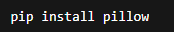
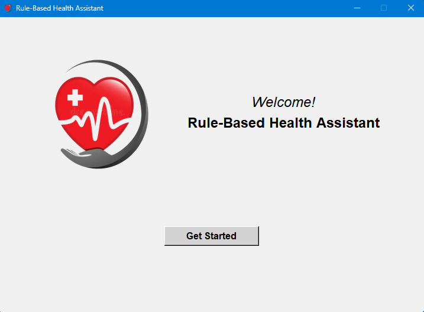
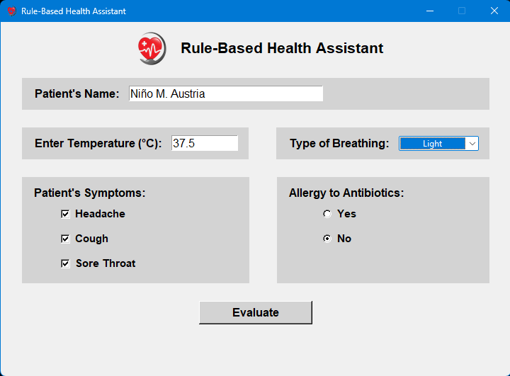
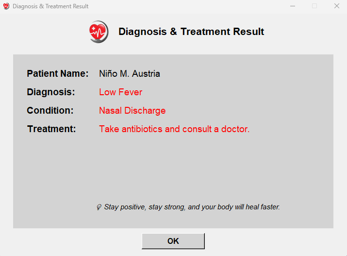

# RuleBasedMedAssistant
Rule-Based Medical Assistant is a simple expert system developed as Laboratory Exercise - 2 in CSci 141 Intelligent Systems. It processes inputs such as temperature, breathing, symptoms, and allergies through rule-based logic, then delivers a diagnosis, condition, and treatment using Python’s Tkinter GUI.

## Requirements to Install

## Welcome Interface

## Main Interface

## Result Interface

