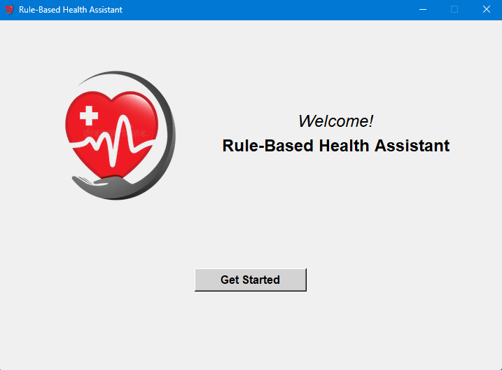
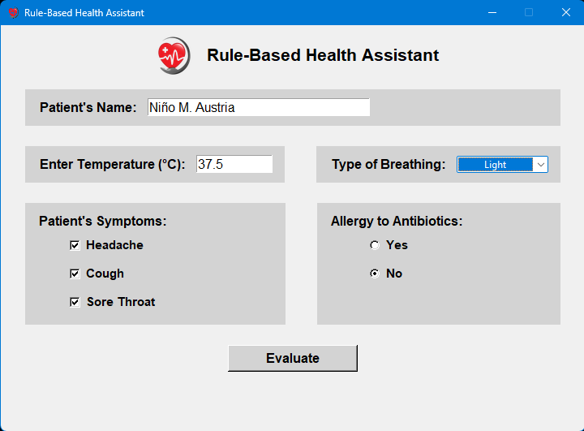
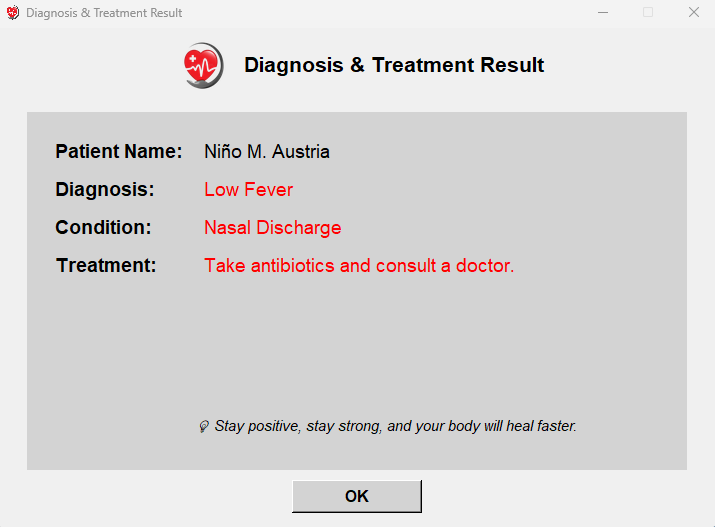

# Rule - Based Health Assistant

## 📖 About
Rule-Based Medical Assistant is a simple expert system developed as Laboratory Exercise - 2 in CSci 141 Intelligent Systems. It processes inputs such as temperature, breathing, symptoms, and allergies through rule-based logic, then delivers a diagnosis, condition, and treatment using Python’s Tkinter GUI.

## ✨ Features/Demo
#### Welcome Interface

#### Main Interface

#### Result Interface

## 🛠️ Tech stack
* Python 3.x  
* Tkinter / ttk  
* Pillow (PIL)  

## ⚙️ Getting Started
### Prerequisites
* Python 3.x  
* pip  
### Installation & Run
1. Installation & Run  
   &nbsp; &nbsp; git clone https://github.com/Nin-Onin/RuleBasedHealthAssistant.git  
   &nbsp; &nbsp; cd RuleBasedHealthAssistant
2. Install the required dependency  
   &nbsp; &nbsp; pip install pillow  
3. Run the application  
   &nbsp; &nbsp; python RuleBasedHealthAssistant.py

## 🚀 Usage
1. Click Get Started on the welcome screen.
2. Fill in the patient's name, temperature (°C), breathing type, symptoms, and allergy status.
3. Click Evaluate to see the diagnosis result.

| Output | Rule |
|---|---|
| No Fever | Temperature < 37°C |
| Low Fever | 37°C ≤ Temperature < 38°C |
| High Fever | Temperature ≥ 38°C |
| Nasal Discharge | Breathing = Light |
| Sinus Membranes Swelling | Breathing = Heavy |
| Take antibiotics and consult a doctor | Fever + all symptoms + no allergy |
| Avoid antibiotics, use alternative treatment | Allergy = Yes |
| Take rest and fluids | No fever or no symptoms |

## 👤 Author
**Niño M. Austria**
- Course: CSci 141 – Intelligent Systems
- GitHub: [@Nin-Onin](https://github.com/Nin-Onin)
